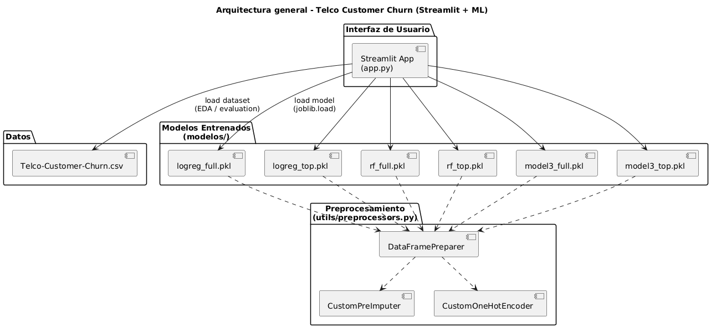

# Telco Customer Churn – Streamlit Application
Midterm Exam – Machine Learning  
Author: Jairo Pérez

## 🎯 Objective
Interactive Streamlit app to:
- Cargar tres modelos entrenados (Logistic Regression, Random Forest, Gradient Boosting).
- Comparar versiones full-features vs. top-features.
- Hacer predicciones individuales de churn.
- Mostrar métricas, matriz de confusión, importancia de features y EDA.
- Incluir comparación global, simulador What-If y recomendaciones de retención.
- Ejecutarse localmente (sin dependencias en la nube).

## 📁 Project Structure


```telco_churn_project/
├── app.py                         # Main Streamlit application
├── README.md                      # Project documentation
├── requirements.txt               # Required packages
│
├── models/
│   ├── logreg_full.pkl
│   ├── logreg_top.pkl
│   ├── rf_full.pkl
│   ├── rf_top.pkl
│   ├── model3_full.pkl
│   ├── model3_top.pkl
│
├── data/
│   └── Telco-Customer-Churn.csv
│
├── utils/
│   ├── preprocessors.py           # DataFramePreparer, CustomImputer, OneHotEncoder
│   └── save_models.py             # Script used to train and export models
│
└── notebooks/
    └── training.ipynb             # EDA, SMOTE, feature selection, model training
```


## 🧠 Included Models
Cada modelo tiene dos versiones:
- **Full Features**: todas las variables originales.
- **Top Features**: subconjunto de variables más importantes.

Modelos:
- Logistic Regression
- Random Forest
- Gradient Boosting Classifier

Cada `.pkl` es un pipeline de Scikit-learn con:
- Preprocesamiento (`DataFramePreparer`)
- Oversampling (SMOTE)
- Clasificador final (`clf`)
Listos para `predict()` y `predict_proba()`.

## 🚀 How to Run (Local)
1) Crear entorno virtual  
`python -m venv .venv`

2) Activar  
Windows: `.\.venv\Scripts\activate`

3) Instalar dependencias  
`pip install -r requirements.txt`

4) Ejecutar Streamlit  
`streamlit run app.py`

La app abre en `http://localhost:8501`.

## 🧩 Application Features
1) **Inferencia individual**: probabilidad de churn, predicción binaria, umbral ajustable.  
2) **Full vs Top Comparison**: Accuracy, F1, AUC y gráficos lado a lado.  
3) **Confusión & Importancia**: matriz de confusión, métricas y feature importance (coeficientes o árbol).  
4) **EDA**: histogramas, correlación, distribución de target, vista previa de tabla.  
5) **Comparativa global**: ranking de seis modelos (Accuracy/F1/AUC) + radar chart.  
6) **What-If + Recomendaciones**: sliders de atributos, probabilidad dinámica y sugerencias de retención (contrato anual, soporte, upgrade, etc.).

## 📤 Deliverables
- Código fuente
- Archivos de modelo `.pkl`
- Notebook de entrenamiento
- Aplicación Streamlit completa
- `requirements.txt`
- README (este documento)

## 🎓 Summary
Solución ML de extremo a extremo para churn:
- Múltiples modelos y versiones
- Pipeline de feature engineering
- Dashboards interactivos
- Simulación y soporte a decisiones de negocio
- Diseño listo para uso práctico en telco

